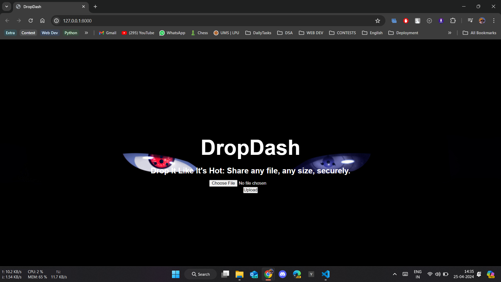
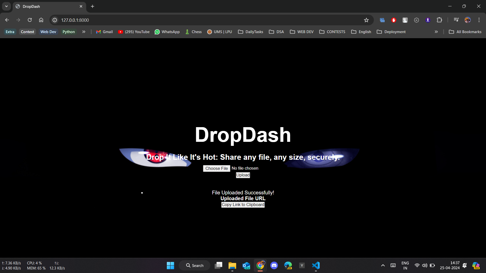
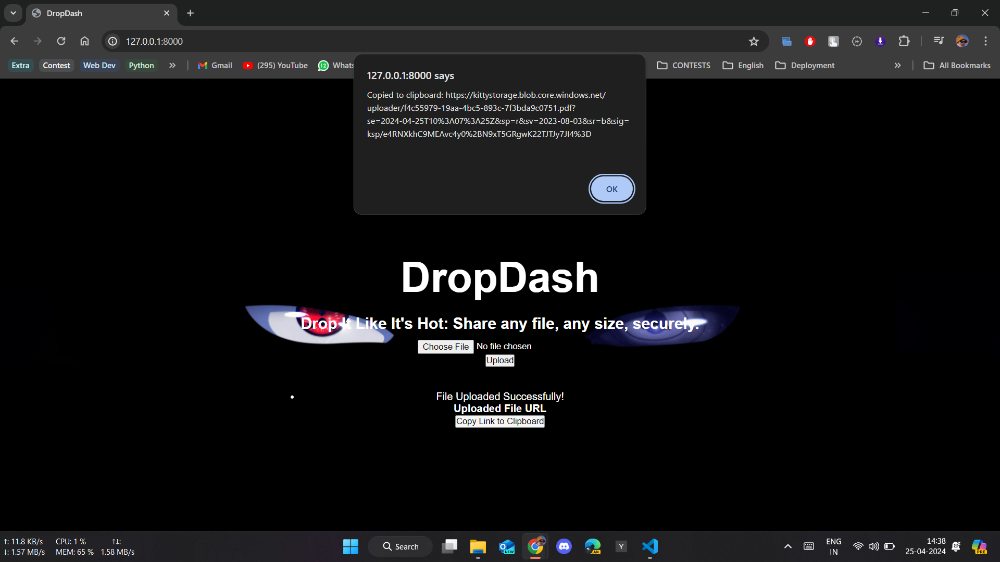

# DropDash

DropDash is a Django-based web application that allows users to upload files securely to Azure Blob Storage and generates a time-limited SAS (Shared Access Signature) URL for the uploaded file.

## Features

- File upload to Azure Blob Storage
- Generation of time-limited SAS URL for uploaded files
- User-friendly interface

## Installation

1. Clone the repository:

```bash
git clone https://github.com/TusharPachouri/DropDash.git
```

2.Install the required dependencies:

```bash
pip install -r requirements.txt
```

3.Set up the required environment variables:

```bash
CONNECTION_STRING=<your_azure_storage_connection_string>
CONTAINER_NAME=<your_azure_storage_container_name>
CUSTOM_DOMAIN=<your_custom_domain_if_any>
```

4.Run the Django development server:

```bash
python manage.py runserver
```

5.Access the application at <http://localhost:8000> in your web browser.

## Screenshots

### Home Page



### Upload Success



### SAS URL


